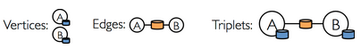

# 5. GraphX
GraphXとはウェブグラフやソーシャルネットワークなどのグラフ作りとページランクや協調フィルタリングなどのグラフ並列計算処理を行う新しいAPIです。
GraphXはSparkの基本抽象概念であるRDD（耐久的分散データセット）を拡張した耐久的分散プロパティグラフを扱います。
耐久的分散プロパティグラフは辺と頂点に特性が付いた有向多重グラフです。
GraphXはグラフ並列計算として重要な操作である[サブグラフ作り、頂点併合、近接集約など](http://spark.apache.org/docs/latest/api/scala/index.html#org.apache.spark.graphx.Graph)をサポートします。
その他にも最適化された状態で[PregelAPI](http://spark.apache.org/docs/latest/graphx-programming-guide.html#pregel)に相似した物もサポートし、進行形で増加中の[グラフアルゴリズム](http://spark.apache.org/docs/latest/graphx-programming-guide.html#graph_algorithms)やグラフ分析を簡潔にする[ビルダー](http://spark.apache.org/docs/latest/graphx-programming-guide.html#graph_builders)を含んでいます。

この章では、GraphXを使ってウィキぺディアのデータを分析するグラフアルゴリズムをSpark内で実行します。GraphXのAPIは現状ではScalaでしか動きませんが、将来的にJavaとPythonの言語サポートも提供される予定です。

## 5-1. GraphXのグラフ並列処理の背景
今すぐ記述されたコードを実行したい方たちはこの部分を飛ばしてもらって結構です。

最近ではソーシャルネットワークや言語モデリングなどの分野でグラフデータの重要性が高まり、規模が広がっています。
その陰で[Giraph](http://giraph.apache.org/)や[GraphLab](https://dato.com/products/create/open_source.html)などの ”グラフ並列計算処理システム(Graph-Parallel Systems)” の開発が進んでいます(それに対してHadoopやSparkは “データ並列計算処理システム(Data-Parallel Systems)”と呼びます)。
グラフ並列計算処理システムは計算処理する型を制限したり新しい方法でデータを分割して分散処理することで、従来のデータ並列計算フレームワークで効率的な処理を行うことが難しかったグラフアルゴリズムを効率的に実行できます。


これらグラフ並列計算処理システムが行う制約は、グラフ並列計算のパフォーマンスを明確に向上させますが、典型的なグラフ分析ワークフローを表現するのが難しくなります。
加えてグラフ並列計算処理システムはページランクなどの反復的なアルゴリズムに最適化される一方で、グラフの構築や構造変形などの基本的なタスクや、複数のグラフにまたがる処理には適していません。

これらの仕組みは結果的にグラフトポロジ外へのデータ変換を必要とし、その変換先はMapReduceのようなデータ並列処理システムとなります。
データの扱い方は課題次第であります。例として、分析中の未整理のデータは複数のテーブルやグラフの見方が必要とされ、各テーブルやグラフの特性を有効にするために効率的で簡潔的なデータ変換が求められます。


加えてデータアナリストにとってはそれぞれの段階でグラフ型の表現とテーブル型の表現を必要に応じて効率的に切り替えることが必要となります。
しかしながら既存の”グラフ並列計算処理システム”や”データ並列計算処理システム”によって構成される分析パイプラインは、この分析ワークフローを実現するために非常に重い計算や、それぞれにおいて異なる複雑なプログラムを書くことをデータアナリストに強いています。


GraphXはこれら既存の”グラフ並列計算処理システム”や”データ並列計算処理システム”を統合し、単一のAPIセットにすることを目指しています。
GraphX APIよって、ユーザはRDD上のデータに変更を加えることなく、グラフ形式として操作するかテーブル形式として操作するかを自由に選択し処理を行うことが出きるようになります。

## 5-2. GraphX APIの紹介
まずは、GraphXの構造から学んでいきましょう。はじめにSparkのシェルを開きます。

```
training/ $ spark-1.6.0/bin/spark-shell
scala>
```

次に、GraphXとRDDをインポートします。

```
scala> import org.apache.spark.graphx._
import org.apache.spark.graphx._
scala> import org.apache.spark.rdd.RDD
import org.apache.spark.rdd.RDD
```
<a id="5-2-1"></a>
### <font color="black">5-2-(1). プロパティグラフ（特性グラフ）の作成</font>
[プロパティグラフ](http://spark.apache.org/docs/latest/api/scala/index.html#org.apache.spark.graphx.Graph)は各辺と頂点にユーザが定義した特性を持つ有向多重グラフです。
有向グラフには辺に方向が付いているので接続元（source)と接続先(destination)が特定されています。
多重グラフとは同じ接続元から接続先に多重の並列している辺がある可能性を示しています。
各頂点はVertexIdという64ビット整数(64-bit long)のIDで特定されています。
それぞれの頂点と辺はプロパティと呼び、ScalaかJavaオブジェクトとして保持されます。

トレーニング前半では、以下のようなソーシャル友人関係を表すプロパティグラフを使用します。データとしてはとても単純ですが、グラフデータのモデルとGraphXを学ぶのに適しています。以下のデータにおける頂点にはユーザ名と年齢が含まれ、辺はベクトルとなります。


まずプロパティグラフを頂点と辺の配列から作成します。後に実際のデータの読み込みをデモします。

まず以下のコマンドをspark-shellで実行します。

```
scala> val vertexArray = Array( (1L, ("Alice", 28)), (2L, ("Bob", 27)), (3L, ("Charlie", 65)), (4L, ("David", 42)), (5L, ("Ed", 55)), (6L, ("Fran", 50)) )
vertexArray: Array[(Long, (String, Int))] = Array((1,(Alice,28)), (2,(Bob,27)), (3,(Charlie,65)), (4,(David,42)), (5,(Ed,55)), (6,(Fran,50)))

scala> val edgeArray = Array( Edge(2L, 1L, 7), Edge(2L, 4L, 2), Edge(3L, 2L, 4), Edge(3L, 6L, 3), Edge(4L, 1L, 1), Edge(5L, 2L, 2), Edge(5L, 3L, 8), Edge(5L, 6L, 3) )
edgeArray: Array[org.apache.spark.graphx.Edge[Int]] = Array(Edge(2,1,7), Edge(2,4,2), Edge(3,2,4), Edge(3,6,3), Edge(4,1,1), Edge(5,2,2), Edge(5,3,8), Edge(5,6,3))
```

辺（Edge)クラスは接続元と接続先の頂点（Vertex)を要素として持ち、さらにもう一つ整数の要素を持ちます。頂点の配列クラスはId、名前、年齢を要素として持っています。

Sparkチュートリアルで習ったsc.parallelizeを使ってvertexArrayおよびedgeArray配列変数をRDDに置き換えます。

```
scala> val vertexRDD: RDD[(Long, (String, Int))] = sc.parallelize(vertexArray)
vertexRDD: org.apache.spark.rdd.RDD[(Long, (String, Int))] = ParallelCollectionRDD[0] at parallelize at <console>:27

scala> val edgeRDD: RDD[Edge[Int]] = sc.parallelize(edgeArray)
edgeRDD: org.apache.spark.rdd.RDD[org.apache.spark.graphx.Edge[Int]] = ParallelCollectionRDD[1] at parallelize at <console>:27
```

これで、グラフを作る準備ができました。プロパティグラフのコンストラクターは頂点RDDと辺RDDを読み込み、グラフ[V,　E]を作成します。頂点RDDの形はRDD[(VertexId, V)]で辺RDDの形はRDD[Edge[E]]です。

```
scala> val graph: Graph[(String, Int), Int] = Graph(vertexRDD, edgeRDD)
graph: org.apache.spark.graphx.Graph[(String, Int),Int] = org.apache.spark.graphx.impl.GraphImpl@431ed0d5
```

このソーシャルネットワークのグラフ内にある頂点の特徴はタプル型の変数(名前(String型), 年齢(Int型))で、辺の特徴は”いいね！”(Int型)です。

RDDのほかに生ファイル、RDD、シンセティックジェネレータからもプロパティグラフを作成できます。
プロパティグラフはRDDのように不変で分散され欠損保障されています。
グラフの型や値を変更したいときは元のグラフに欲しい変化を付け加え新しいグラフを作成できます。構造、特徴、指数に相当する部分は新しいグラフにも引き継がれます。
また、RDDと同様に、グラフデータはノードの故障の際には異なるノードで再構築されます。

### <font color="black">5-2-(2). グラフを見る</font>
殆どの要件では計算処理の結果を集合やセーブする際に頂点と辺のRDDを展開する処理を行います。
そのためグラフのクラスは頂点と辺の特性にアクセスする為にgraph.verticesとgraph.edgesのメンバーを含んでいます。
このメンバーはRDD[(VertexId, V)]とRDD[Edge[E]]の拡張型であり、GraphX内部のグラフデータ描写のために最適化されています。

graph.verticesを使って30歳以上のユーザーを見てみる。（命令の仕方は2通りあり、出力は以下です）

```
scala> graph.vertices.filter { case (id, (name, age)) => age > 30 }.collect.foreach { case (id, (name, age)) => println(s"$name is $age") }
David is 42
Fran is 50
Charlie is 65
Ed is 55

//caseを使わない場合
scala> graph.vertices.filter(v => v._2._2 > 30).collect.foreach(v => println(s"${v._2._1} is ${v._2._2}") )
//上と同じ
```

辺と頂点の特性に加えて、プロパティグラフはトリプレット（三つ子）と呼ばれている特殊なビューも含んでいます。
トリプレットビューは頂点と辺の特性を統合させEdgeTripletクラスを含むRDD[EdgeTriplet[VD, ED]]を与えます。
EdgeTripletクラスはEdgeクラスを接続元（srcAttr）と接続先（dstAttr）を加えて拡張した形です。
以下が絵で表したものです。



graph.tripletsを使って誰がどのユーザーにいいね！を与えたかを見てみる。（2通りある）

```
scala> for (triplet <- graph.triplets.collect) { println(s"${triplet.srcAttr._1} likes ${triplet.dstAttr._1}") }
Bob likes Alice
Bob likes David
Charlie likes Bob
Charlie likes Fran
David likes Alice
Ed likes Bob
Ed likes Charlie
Ed likes Fran

//forを使わない場合
scala> graph.triplets.collect.foreach(triplet => println(s"${triplet.srcAttr._1} likes ${triplet.dstAttr._1}") )　
//上と同じ
```

いいね！を5回以上与えたユーザーを見てみる。

```
scala> graph.triplets.filter(t => t.attr > 5).collect.foreach(triplet => println(s"${triplet.srcAttr._1} loves ${triplet.dstAttr._1}") )
Bob loves Alice
Ed loves Charlie
```

## 5-3. グラフオペレータ（操作）
RDDに基本的な操作としてcount, map, filter, reduceByKeyなどがあるように、プロパティグラフも基本的な操作を行う関数群があります。
以下はGraph　APIで使われている一部の関数の例です。

```
/** プロパティグラフの機能性のまとめ*/
class Graph[VD, ED] {
  // グラフの情報
  val numEdges: Long
  val numVertices: Long
  val inDegrees: VertexRDD[Int]
  val outDegrees: VertexRDD[Int]
  val degrees: VertexRDD[Int]

  // グラフをコレクションとして内覧
  val vertices: VertexRDD[VD]
  val edges: EdgeRDD[ED]
  val triplets: RDD[EdgeTriplet[VD, ED]]

  // 分割り過程を変える
  def partitionBy(partitionStrategy: PartitionStrategy): Graph[VD, ED]

  // 頂点と辺の特徴を変換する
  def mapVertices[VD2](map: (VertexID, VD) => VD2): Graph[VD2, ED]
  def mapEdges[ED2](map: Edge[ED] => ED2): Graph[VD, ED2]
  def mapEdges[ED2](map: (PartitionID, Iterator[Edge[ED]]) => Iterator[ED2]): Graph[VD, ED2]
  def mapTriplets[ED2](map: EdgeTriplet[VD, ED] => ED2): Graph[VD, ED2]

  // グラフ構造を変更する
  def reverse: Graph[VD, ED]
  def subgraph(
      epred: EdgeTriplet[VD,ED] => Boolean = (x => true),
      vpred: (VertexID, VD) => Boolean = ((v, d) => true))
    : Graph[VD, ED]
  def groupEdges(merge: (ED, ED) => ED): Graph[VD, ED]

  // RDDをグラフと統合する
  def joinVertices[U](table: RDD[(VertexID, U)])(mapFunc: (VertexID, VD, U) => VD): Graph[VD, ED]
  def outerJoinVertices[U, VD2](other: RDD[(VertexID, U)])
      (mapFunc: (VertexID, VD, Option[U]) => VD2)
    : Graph[VD2, ED]

  // 隣のトリプレットの情報を集合する
  def collectNeighbors(edgeDirection: EdgeDirection): VertexRDD[Array[(VertexID, VD)]]
  def mapReduceTriplets[A: ClassTag](
      mapFunc: EdgeTriplet[VD, ED] => Iterator[(VertexID, A)],
      reduceFunc: (A, A) => A)
    : VertexRDD[A]

  //　反復的グラフ並列計算
  def pregel[A](initialMsg: A, maxIterations: Int, activeDirection: EdgeDirection)(
      vprog: (VertexID, VD, A) => VD,
      sendMsg: EdgeTriplet[VD, ED] => Iterator[(VertexID,A)],
      mergeMsg: (A, A) => A)
    : Graph[VD, ED]

  // 基本グラフアルゴリズム
  def pageRank(tol: Double, resetProb: Double = 0.15): Graph[Double, Double]
  def connectedComponents(): Graph[VertexID, ED]
  def triangleCount(): Graph[Int, ED]
  def stronglyConnectedComponents(numIter: Int): Graph[VertexID, ED]
}
```

これらの関数はGraphとGraphOpsに分かれています。しかし、Scalaによる暗黙の変換によってGraphのメンバーとしてGraphOpsを利用することができます。

例として、各頂点に入っていくる辺（入次数）を計算してみましょう。
今回の例でたとえると、誰が誰にいいね！を貰ったかがこの計算でわかります。

`val inDegrees: VertexRDD[Int] = graph.inDegrees`

上の例ではgraph.inDegreesオペレータがVertexRDD[Int]を返します（これはRDD[(VertexId, Int)]として動くことを覚えてください）。
ここで入次数と出次数を各頂点に頂点特徴として合体したいと思います。この作業は一般的なグラフオペレータをセットで使います。

はじめに、加える特性（inDegとoutDeg)を整列するために新しいクラスを作ります。
そして、このユーザ特徴を使って新しいグラフを作ります。

```
クラスを定義してユーザ特徴をもっと明確に形成します。
scala> case class User(name: String, age: Int, inDeg: Int, outDeg: Int)
defined class User

ユーザグラフを作成します。
scala> val initialUserGraph: Graph[User, Int] = graph.mapVertices{ case(id, (name, age)) => User(name, age, 0, 0) }
initialUserGraph: org.apache.spark.graphx.Graph[User,Int] = org.apache.spark.graphx.impl.GraphImpl@2fb38a1a
```

新しいグラフを作った際は各頂点の入次数と出次数の初期設定を0に定義しました。
そこで、この情報をグラフに読み込み新しい頂点特性を構築しました。

```
入次数と出次数の情報を埋め込みます。
scala> val userGraph = initialUserGraph.outerJoinVertices(initialUserGraph.inDegrees) { case (id, u, inDegOpt) => User(u.name, u.age, inDegOpt.getOrElse(0), u.outDeg) }.outerJoinVertices(initialUserGraph.outDegrees) { case (id, u, outDegOpt) => User(u.name, u.age, u.inDeg, outDegOpt.getOrElse(0)) }
userGraph: org.apache.spark.graphx.Graph[User,Int] = org.apache.spark.graphx.impl.GraphImpl@1a9fea8
```

ここではouterJoinVerticesというグラフのメソッド使いました。
このメソッドは以下のような（混乱しそうな）シグネチャタイプです。

```
def outerJoinVertices[U, VD2](other: RDD[(VertexID, U)])
      (mapFunc: (VertexID, VD, Option[U]) => VD2)
    : Graph[VD2, ED]
```

お気づきかもしれませんがouterJoinVerticesは二つの引数があります。
一つ目が頂点値のRDDで、二つ目のリスト引数がRDDのid, attribute, Optionalで合わせる値からの関数を受けて新しい頂点値に流します。
入力RDDが多少グラフの頂点の値を含んでいない可能性があります。
その場合はOption引数が空でoptOutDeg.getOrElse(0)が0を返します。

新しくできたuserGraphを使って、どのユーザーが何人からいいね！を貰ったかを見てみます。

```
scala> for ((id, property) <- userGraph.vertices.collect) { println(s"User $id is called ${property.name} and is liked by ${property.inDeg} people.") }
User 4 is called David and is liked by 1 people.
User 1 is called Alice and is liked by 2 people.
User 6 is called Fran and is liked by 2 people.
User 3 is called Charlie and is liked by 1 people.
User 5 is called Ed and is liked by 0 people.
User 2 is called Bob and is liked by 2 people.
```

最後にいいねを与えた人数と貰った人数が同じユーザーを見てみます。

```
scala> userGraph.vertices.filter { case (id, u) => u.inDeg == u.outDeg }.collect.foreach { case (id, property) => println(property.name) }
David
Bob
```

### <font color="black">5-3-(1). MapReduceTripletというオペレータ</font>
[5-2-(1)](#5-2-1)で作成したプロパティグラフを使って一番年上のフォローワーを探したいとします。
この作業はmapReduceTripletオペレータによって可能になります。
このオペレータはGraphXで徹底的に最適化されたコアとなる集約機能です。

ページランクなどグラフアルゴリズムは近接頂点のプロパティを反復的に集約するので、近接集合はグラフ計算で最も重要です。

この操作の単純化したシグネチャは以下のようになります。

```
class Graph[VD, ED] {
  def mapReduceTriplets[MsgType](
      // エッジトリプレットからメッセージのコレクションへの関数 (すなわち Map)
      map: EdgeTriplet[VD, ED] => Iterator[(VertexId, MsgType)],
      // メッセージを同じ頂点に結合する関数 (すなわち Reduce)
      reduce: (MsgType, MsgType) => MsgType)
    : VertexRDD[MsgType]
}
```

map関数は各エッジトリプレットに適用され繋いでいる頂点にメッセージを送ります。
そして、reduce関数が送られてきたメッセージを各頂点ごとに集約します。
この操作の結果は各頂点に集約されたメッセージを含むVertexRDDです。

各ユーザの一番年上のフォロワーはそのフォロワーの名前と年齢を含んだメッセージを送り、一番年上のメッセージだけを集約することで調べることができます。


各ユーザの一番年上のフォローワーを探す。

```
scala> val oldestFollower: VertexRDD[(String, Int)] = userGraph.mapReduceTriplets[(String, Int)]( edge => Iterator((edge.dstId, (edge.srcAttr.name, edge.srcAttr.age))), (a, b) => if (a._2 > b._2) a else b)
各エッジから接続先の特性を載せたメッセージを接続先に送ります

oldestFollower: org.apache.spark.graphx.VertexRDD[(String, Int)] = VertexRDDImpl[49] at RDD at VertexRDD.scala:57
```

各ユーザの一番年上のフォロワーを表示します。

```
scala> userGraph.vertices.leftJoin(oldestFollower) { (id, user, optOldestFollower) => optOldestFollower match { case None => s"${user.name} does not have any followers." case Some((name, age)) => s"${name} is the oldest follower of ${user.name}." } }.collect.foreach { case (id, str) => println(str) }


David is the oldest follower of Alice.
Charlie is the oldest follower of Fran.
Ed is the oldest follower of Charlie.
Bob is the oldest follower of David.
Ed does not have any followers.
Charlie is the oldest follower of Bob.
```

各ユーザのフォロワーの平均年齢を計算します。

```
scala> val averageAge: VertexRDD[Double] = userGraph.mapReduceTriplets[(Int, Double)]( edge => Iterator((edge.dstId, (1, edge.srcAttr.age.toDouble))), (a, b) => ((a._1 + b._1), (a._2 + b._2)) ).mapValues((id, p) => p._2 / p._1)
averageAge: org.apache.spark.graphx.VertexRDD[Double] = VertexRDDImpl[57] at RDD at VertexRDD.scala:57

scala> userGraph.vertices.leftJoin(averageAge) { (id, user, optAverageAge) => optAverageAge match { case None => s"${user.name} does not have any followers." case Some(avgAge) => s"The average age of ${user.name}\'s followers is $avgAge." } }.collect.foreach { case (id, str) => println(str) }
The average age of David's followers is 27.0.
The average age of Alice's followers is 34.5.
The average age of Fran's followers is 60.0.
The average age of Charlie's followers is 55.0.
Ed does not have any followers.
The average age of Bob's followers is 60.0.
```

### <font color="black">5-3-(2). サブグラフ</font>
30歳以上のユーザからなるコミュニティを詳しく調べたいという状況になったとします。
この様な分析を行うためにGraphXのサブグラフというオペレータを使います。
サブグラフとは全体のグラフの一部を切り取り作成したグラフです。
頂点はユーザが記述した頂点性質を満たしている物のみ取り出します。
辺も同じくユーザが記述した辺性質を満たしている物だけが返されて、繋いでいる頂点は記述が満たされている物だけを繋げます。

ここからはsubgraphを使ってグラフを30歳以上のコミュニティに制限します。

```
scala> val olderGraph = userGraph.subgraph(vpred = (id, user) => user.age >= 30)
olderGraph: org.apache.spark.graphx.Graph[User,Int] = org.apache.spark.graphx.impl.GraphImpl@68941ca4
```

この制限されたグラフ内のコミュニティを考察してみます。

```
scala> val cc = olderGraph.connectedComponents
cc: org.apache.spark.graphx.Graph[org.apache.spark.graphx.VertexId,Int] = org.apache.spark.graphx.impl.GraphImpl@5813c42a

scala> olderGraph.vertices.leftJoin(cc.vertices) { case (id, user, comp) => s"${user.name} is in component ${comp.get}" }.collect.foreach{ case (id, str) => println(str) }
David is in component 4
Fran is in component 3
Charlie is in component 3
Ed is in component 3
```

繋がっているコンポーネントのそのコンポーネント内で一番低いVertexIdが標識に採用されています。
サブグラフを調査してみますと、Davidが残りのコミュニティから切断されています。
さらに、Davidは元のグラフでは若いユーザを通して繋がっていたと解ります。

## 5-4. リアルデータ上の端末間のグラフ分析パイプラインを作成
ここまででGraphX APIの個々のコンポーネントを学習しました。それらの知識を総合し、最終的な分析パイプラインの構築をしてみましょう。
ここからはウィキペディアのリンクデータからはじめ、GraphX操作を用いて構造を分析し、Sparkのオペレータでグラフ分析の出力を調べます。
これらはすべてSparkシェルから行います。

GraphXは最適な性能を得るためにKyroシリアライザを必要とします。
今、どんなシリアライザを使っているかを調べるためにhttp://sparkホスト:4040/environmentに移行してSpark Shell UIを開き、spark.serializerのプロパティがセットされているかを確認して下さい。


デフォルトでは、Kyroシリアライザはオフになっています。
この練習では、Sparkシェル内のKyroシリアライザをオンにする手順を説明をします。
まず、Sparkシェルを抜けてください（exitかctrl-cを入力）。

テキストエディタ（EmacsやVimなど）でspark/conf/spark-env.shを開き、以下を付け加えてください。

```
SPARK_JAVA_OPTS+='
　-Dspark.serializer=org.apache.spark.serializer.KryoSerializer
　-Dspark.kyro.registrator=org.apache.spark.graphx.GraphKryoRegistrator ‘
export SPARK_JAVA_OPTS
```

もしくは以下のコマンドをターミナルで実行してください（SparkShellではなく）。

```
usb/$ echo -e "SPARK_JAVA_OPTS+=' -Dspark.serializer=org.apache.spark.serializer.KryoSerializer -Dspark.kryo.registrator=org.apache.spark.graphx.GraphKryoRegistrator ' \nexport SPARK_JAVA_OPTS" >> spark/conf/spark-env.sh
```

ここで、Spark Shellを再起動してもう一度環境状況をhttp://sparkホスト:4040/environmentで見てみましょう。
シリアライザプロパティがorg.apache.spark.serializer.KyroSerializerに設定されているはずです。


### <font color="black">5-4-(1). 再起動</font>
Sparkシェルを起動し、パッケージをインポートしてください。

```
training/ $ spark-1.6.0/bin/spark-shell
scala>

import org.apache.spark.graphx._
import org.apache.spark.rdd.RDD
```

### <font color="black">5-4-(2). ウィキペディア記事の読み込み</font>
ウィキペディアは百科事典すべての記事を[XMLのダンプデータ](http://en.wikipedia.org/wiki/Wikipedia:Database_download#English-language_Wikipedia)として提供しています。
最新のものは44GBありますので、前処理とフィルターを（もちろんSparkとGraphXを使って）行ってUSBドライブに収まりきる程度にしておきました。
このトレーニングでは”Berkeley”の入った記事とその記事からリンクされている・している記事を切り取ってあります。
この結果のデータセットは二つのファイルに記録されています。
“data/graphx/graphx-wiki-vertices.txt”と”data/graphx/graphx-edges.txt”です。
最初のファイルが記事のIDとタイトルを記録してあり、二個目がリンク構造を接続元-接続先IDペアとして記録されています。

この二つのファイルをRDDにロードしてください。

```
scala> val articles: RDD[String] = sc.textFile("data/graphx/graphx-wiki-vertices.txt")
//articles: org.apache.spark.rdd.RDD[String] = data/graphx/graphx-wiki-vertices.txt MappedRDD[1] at textFile at <console>:16

scala> val links: RDD[String] = sc.textFile("data/graphx/graphx-wiki-edges.txt")
//links: org.apache.spark.rdd.RDD[String] = data/graphx/graphx-wiki-edges.txt MappedRDD[3] at textFile at <console>:16
```

### <font color="black">5-4-(3). 最初の記事を見る</font>

```
articles.first
// res1: String = 6598434222544540151      Adelaide Hanscom Leeson
```

### <font color="black">5-4-(4). グラフを作成する</font>
記事とリンクを使ってバークレー大学に関わる記事のグラフを作りましょう。

まずは記事の列を頂点IDとタイトルのペアに分解します。

```
scala> val vertices = articles.map { line => val fields = line.split('\t'); (fields(0).toLong, fields(1)) }

// vertices: org.apache.spark.rdd.RDD[(Long, String)] = MappedRDD[4] at map at <console>:18
```

次にリンクの列をプレースホルダーの０を加えて辺オブジェクトに分解します。

```
scala> val edges = links.map { line => val fields = line.split('\t'); Edge(fields(0).toLong, fields(1).toLong, 0) }
//edges: org.apache.spark.rdd.RDD[org.apache.spark.graphx.Edge[Int]] = MappedRDD[5] at map at <console>:18
```

最後にグラフコンストラクタを頂点RDD、辺RDD、デフォルトの頂点の要素とセットにして呼び出し、グラフを作成します。
デフォルトの頂点要素は頂点RDDに存在しない、辺で結ばれている頂点（リンクで繋がっている記事）の初期化に使います。
このデータセットは不整合な要素は既に取り除かれていますが、現実のデータセットは整理されていません。
壊れているリンク先はデフォルトの頂点要素を空のタイトル文字列として使います。

ディスクからの再読み込みを防ぐためにキャッシュをしてからグラフを作成します。

```
scala> val graph = Graph(vertices, edges, "").cache()
// graph: org.apache.spark.graphx.Graph[String,Int] = org.apache.spark.graphx.impl.GraphImpl@5b1e4029
```

グラフを強制的に計算させるために、何個の記事がこのグラフにあるかを数えましょう。

```
scala> graph.vertices.count
res2: Long = 22424
```
GraphXは最初のグラフが作成される時、すべての頂点のインデックスデータ構造を構築し、存在しない頂点の認識します。
トリプレットの計算処理は追加の統合を必要としますが、インデックスのおかげで速く動いてくれます。

はじめに数個のトリプレットを見てみましょう。

```
scala> graph.triplets.count
res3: Long = 31312

scala> graph.triplets.take(5).foreach(println(_))
((146271392968588,Computer Consoles Inc.),(7097126743572404313,Berkeley Software Distribution),0)
((146271392968588,Computer Consoles Inc.),(8830299306937918434,University of California, Berkeley),0)
((625290464179456,List of Penguin Classics),(1735121673437871410,George Berkeley),0)
((1342848262636510,List of college swimming and diving teams),(8830299306937918434,University of California, Berkeley),0)
((1889887370673623,Anthony Pawson),(8830299306937918434,University of California, Berkeley),0)
```

先ほど言った通り、データセット内のトリプレットは”Berkeley”の文字が接続元か接続先の記事タイトルに現れます。


### <font color="black">5-4-(5). ページランクをウィキペディアで行う</font>
次にグラフ分析を開始できます。この例では[ページランク](http://en.wikipedia.org/wiki/PageRank)を使ってウィキペディアグラフ内の最も重要なページを評価します。
[ページランク](http://spark.apache.org/docs/latest/api/scala/index.html#org.apache.spark.graphx.lib.PageRank$)は小さいながらも成長の続いている、GraphXにすでに実装された一般的なグラフアルゴリズムの一部です。
実行方法は複雑ではありません。
単に初期設定のコード、頂点プログラム、メッセージコンバイナをPregelに送るだけでできます。

graph.pageRankを使ってページランクを行う。

```
scala> val prGraph = graph.pageRank(0.001).cache()
// prGraph: org.apache.spark.graphx.Graph[Double,Double] = org.apache.spark.graphx.impl.GraphImpl@3153be16
```

この結果は頂点性質が各ページのページランク値であるグラフを返します。
0.001のパラメータは許容誤差でページランクの境界値です。

この結果では、prGraphがタイトルなどの最初の頂点性質を含んでおらずページランク値しか持っていません。
元のgraphがその情報を持っています。
そこで、頂点の統合を行うことでprGraphの頂点のランク値と元のgraphが持つ頂点要素である記事タイトルを合わせることができます。
出来上がるのが二つの情報を統合された新しいグラフで、頂点性質をタプル型としてセーブできます。
そこでこの新しいリストからTop10の頂点を探すことやそれに一致する記事のタイトルをプリントするなどのテーブル型の操作をこの頂点に行うことが可能になります。
これらの作業はを以下の操作を組み合わせると「バークレー」サブグラフのなかで重要性Top10のページを探ることができます。

```
scala> val titleAndPrGraph = graph.outerJoinVertices(prGraph.vertices) { (v, title, rank) => (rank.getOrElse(0.0), title) }
// titleAndPrGraph: org.apache.spark.graphx.Graph[(Double, String),Int] = org.apache.spark.graphx.impl.GraphImpl@7c7a6ea8


scala> titleAndPrGraph.vertices.top(10) { Ordering.by((entry: (VertexId, (Double, String))) => entry._2._1) }.foreach(t => println(t._2._2 + ": " + t._2._1))

University of California, Berkeley: 1321.111754312097
Berkeley, California: 664.8841977233583
Uc berkeley: 162.50132743397873
Berkeley Software Distribution: 90.4786038848606
Lawrence Berkeley National Laboratory: 81.90404939641944
George Berkeley: 81.85226118457985
Busby Berkeley: 47.871998218019655
Berkeley Hills: 44.76406979519754
Xander Berkeley: 30.324075347288037
Berkeley County, South Carolina: 28.908336483710308
```

これでGraphXのチュートリアルの章は終わりです。GraphXのコードをいろいろ変えて遊んでみてください。[GraphXのプログラミングガイド](http://spark.incubator.apache.org/docs/latest/graphx-programming-guide.html)を補足としてチェックすることをお勧めします。

