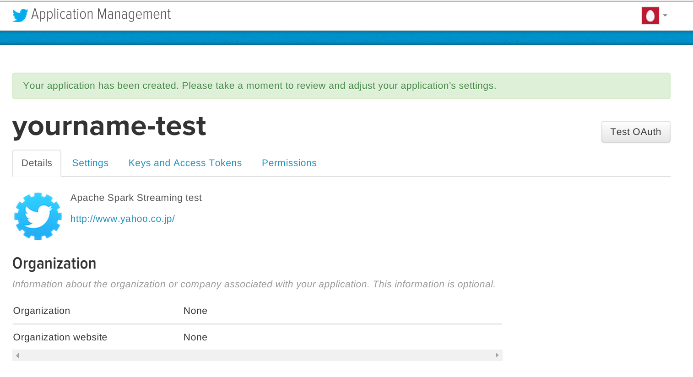
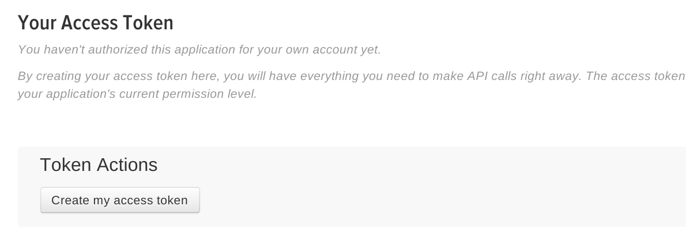

ストリーミング処理とは、twitterやfacebookのように、絶え間なく流れてくるリアルタイム・ストリームデータを入力として受け付け、逐次処理を行うことを言います。
Sparkが持つSpark Streamingライブラリは非常にスケーラブルであり、高い可用性を持ったストリーム処理を行うことができます。

このトレーニングでは、実際のtwitterのストリームデータを受け付け、処理するプログラムを作成します。
プログラムはScala, Javaで記述することができます。(注：本書ではScalaのプログラムのみを取り上げます)

# 3-1. トレーニング用ファイルの構成、事前に用意するもの
トレーニング用ファイルは以下のような構成になっています

|ファイル名                                   |内容                                                     |
|:--------------------------------------------|:--------------------------------------------------------|
|training/streaming/scala/build.sbt           |SBTプロジェクトファイル                                  |
|training/streaming/scala/Tutorial.scala      |本トレーニングで実際に編集・コンパイル・実行するファイル |
|training/streaming/scala/TutorialHelper.scala|Tutorial.scalaから呼び出されるヘルパー関数のファイル     |

ヘルパー関数として以下のものをあらかじめ用意しています。

- getCheckpointDirectory(): Spark Streamingで使用されるチェックポイントディレクトリを取得する関数
- configureTwitterCredential(): Twitterのクレデンシャルを取得するためのヘルパー関数。詳細は後述。

また、Twitterのアカウントがない場合は事前に取得するようにしてください。
Twitterアカウントに携帯電話番号が登録されている必要があります。

# 3-2. Twitterのクレデンシャルを取得する
このトレーニングではTwitterのストリームデータを使用するため、Twitterによる認証を行う必要があります。
これにはTwitterのアカウントを取得することで使用できる、”Consumer Key”と”Consumer Secret”のペアと、”Access Token”と”Access Key”のペアが必要になります。
これにより、アプリケーションはTwitterのユーザ名、パスワードを使用することなくアカウントの情報や、各種のストリームデータを利用することができるようになります。

これから作成する”Consumer Key”と”Consumer Secret”のペアと、”Access Token”と”Access Key”のペアは一時的な利用にとどめ、このトレーニングが終わったら破棄することもできます。
これによりトレーニングによって作成されたプログラムを使用して、他のユーザがあなたのアカウントのストリームを見たり、書き込んだりすることを防ぐことができます。

それではTwitterのクレデンシャルを取得しましょう。ブラウザで[Twitterのアプリケーション管理ページ](https://dev.twitter.com/apps)を開きます。(必要に応じてTwitterにサインインしてください。なお手順を完了するためには、事前にTwitterアカウントに携帯電話番号が登録されている必要があります)


このトレーニングのアプリケーションのために、新しくクレデンシャルを作成します。画面右上の[Create New App]ボタンをクリックします。


画面内に必要事項を入力します。このトレーニングでは以下のように入力します。

Name: [twitterのハンドル名]-test

Description: Apache Spark Streaming test

Website: http://www.yahoo.co.jp/ (なんでもよいが、ブラウザで開けるページが好ましい)

Callback URL: (空欄)

全ての項目を埋めたら、”Developer Aggreement”にチェックを入れ、[Create your Twitter application]をクリックします。

作成が完了すると以下のようなページに遷移します。



上記ページ中の[Keys and Access Tokens]タブを開きます。
すでに”Consumer Key(API Key)”および”Consumer Secret(API Secret)”が生成されていることが分かります。

注意：特に”Consumer Key”および”Consumer Secret”は安全に管理し、他の人と共有しないようにしてください。”Consumer Key(API Key)”および”Consumer Secret(API Secret)”の組み合わせで、他の人があたかもあなたのアカウントでTwitterの認証を通過できる可能性があります。


ページ下部の[Create my access token]ボタンを押します。

これで”Access Token”と”Access Key”のペアが作成されます。

注意：”Access Token”と”Access Key”のペアは安全に管理し、他の人と共有しないようにしてください。”Access Token”と”Access Key”の組み合わせで、他の人があたかもあなたのアカウントでTwitterのAPIを利用できる可能性があります。



ここまでの手順で以下の情報が入手できました。

- Consumer Key(API Key)
- Consumer Secret(API Secret)
- Access Token
- Access Key

この情報を使用して、Spark Streamingアプリケーションを作成します。

# 3-3. Spark Streamingアプリケーションの作成
トレーニングプログラムには以下のようなScalaスクリプトのひな形があります。これを元に、順番に機能を追加し、最終的なアプリケーションを作成します。


```
object Tutorial {
  def main(args: Array[String]) {

    // Checkpoint directory
    val checkpointDir = TutorialHelper.getCheckpointDirectory()

    // Configure Twitter credentials
    val apiKey = "(追加)"
    val apiSecret = "(追加)"
    val accessToken = "(追加)"
    val accessTokenSecret = "(追加)"
    TutorialHelper.configureTwitterCredentials(apiKey, apiSecret, accessToken, accessTokenSecret)

    // Your code goes here

  }
}
```


上記の”(追加)”には、３－２.で作成した、それぞれのキーをセットします

次に、”Your code goes here”の部分にプログラムを追加していきます。

最初に以下の命令を入れます

val ssc = new StreamingContext(new SparkConf(), Seconds(1))

これによりSparkのStreamingContextオブジェクトを作成します。SparkConfオブジェクトと、バッチ実行間隔を指定します。上記の例では”1秒”を指定しています。つまり1秒間に取得したストリームデータが、１つのバッチジョブとして分割実行されるという指定になります。

val tweets = TwitterUtils.createStream(ssc, None)

変数tweetsはDStreamクラスで表現されたTwitterのステータスの一覧です。より具体的に言うのであれば、変数tweetsはtwitter4j.Statusクラスを内部に持つRDDオブジェクトの連続(配列)であると言うことができます。 

ここまでで、上記にセットした認証情報を元にアプリケーションはTwitterに接続できるはずです。正しく接続されたかを確認するために、ステータス(=実際のツイート内容)を書き出してみます。

val statuses = tweets.map(status => status.getText())
statuses.print()

【備考】
tweets.map(status => status.getText()) に使用される”=>”はScalaにおいては「ラムダ式」と解釈され、無名関数として使用されています。つまりここでのtweets.statusプロパティは、getText()メソッドによってString(文字列)に変換された上で、DStreamオブジェクトであるstatusesに格納されます。

tweets.mapメソッドにより、tweetsストリームにおける個々のstatusプロパティは、getText()メソッドによって文字列に変換されたのちに、statusesという名前のDStreamオブジェクトにそれぞれマッピングされます。

printメソッドは、statuses DStreamオブジェクトの最初の10個を出力します。これは1秒ごとに実行されます

またストリーミングにおいては定期的にチェックポイントデータをディスクに書き出し、データの損失を防止します。

ssc.checkpoint(checkpointDir)

最後にStreamingContextの実行を開始するよう指示します。DStreamオブジェクトへの操作は、この”ssc.start()”の前に書かれていることが必要です。

ssc.start()
ssc.awaitTermination()

これでプログラムができました。
改めてプログラム全体を再掲します。緑字部分がもともとのテンプレートから変化した部分です。

training/streaming/scala/Tutorial.scala
import org.apache.spark._
import org.apache.spark.SparkContext._
import org.apache.spark.streaming._
import org.apache.spark.streaming.twitter._
import org.apache.spark.streaming.StreamingContext._
import TutorialHelper._

object Tutorial {
  def main(args: Array[String]) {

    // Checkpoint directory
    val checkpointDir = TutorialHelper.getCheckpointDirectory()

    // Configure Twitter credentials
    val apiKey = "bNcABXXXXXXXXXXXXX5dCpHR"
    val apiSecret = "dZ9yDEBpmLJhOXXXXXXXXXXXXXXXXXXXft2xzOlfH"
    val accessToken = "NNNNNNNN-RZH5M1MFxTNXXXXXXXXXXXXXXXXXXl9tl2"
    val accessTokenSecret = "UBRkxVeTXXXXXXXXXXXXXXXXXXXXX0aOn0kuT6FIfUhpxst"
    TutorialHelper.configureTwitterCredentials(apiKey, apiSecret, accessToken, accessTokenSecret)

    // Your code goes here
    val ssc = new StreamingContext(new SparkConf(), Seconds(1))
    val tweets = TwitterUtils.createStream(ssc, None)
    val statuses = tweets.map(status => status.getText())
    statuses.print()
    ssc.checkpoint(checkpointDir)
    ssc.start()
    ssc.awaitTermination()
  }
}


# 3-4. サンプルアプリケーションのコンパイル・実行

# 3-5. サンプルアプリケーションを改修する

# 3-6. ストリーム処理の分散

# 3-7. ストリームのリアルタイムな状況確認

# 【備考】 入力ストリーム量について
