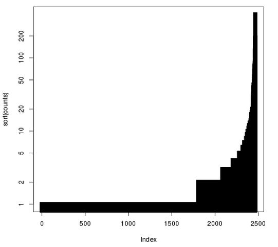

この章では、SparkRシェルを使ってウィキぺディアのデータを対話的（インタラクティブ）に探究します。

# 6-1. 必須であるもの
SparkRの練習を行うには、RとrJavaのインストールが必要です。
必要なバイナリはトレーニング用のディレクトリ（training-downloads.zipを参照）に含まれています。

まずはRをインストールし、シェルを起動します。

```
$ sudo yum install R
$ R
```

それから、以下の命令をRシェルから試してください。
rJavaのインストールと正常に動くかを確認するためにrJavaをロードします。

```
> install.packages(“rJava”)
> library(rJava)
```

もし、２行目のコマンドの後に何の出力がでなければ、rJavaが正常にインストールされた証拠です。
もし、rJavaインストール中にエラーのメッセージが出ましたら、以下を行いRのJavaを設定します。

RのJava設定　（正常に動いていたら無視）

`training/ $ R CMD javareconf -e　 //trainingとはトレーニング用データを入れたディレクトリ`

これが終わりましたら、Rを再起動してrJavaをインストールしてください。

# 6-2. データセットの確保
[1-1. 用意するもの](introduction.md)の注意事項を従ってください。
適したtraining-downloads.zipファイルをダウンロードして展開しましたら、準備完了です。

# 6-3. SparkContextのインストールと作成
下のコードはMac OS Xを想定していますが、LinuxやWindowsもサポートされているでしょう。

```
training/ $ R                                   
 //トレーニングディレクトリからRを起動する。

> pkgPath <- “SparkR/linux/SparkR_0.1_R_x86_64-redhat-linux-gnu.tar.gz”  
//使用しているOSに合わせることと、最後のファイル名も入っているもと合わせて下さい。

> install.packages(pkgPath)

Installing package into ‘/usr/lib64/R/library’
(as ‘lib’ is unspecified)
inferring 'repos = NULL' from 'pkgs'
* installing *binary* package ‘SparkR’ ...
* DONE (SparkR)
Making 'packages.html' ... done　　//実行した時の出力
```

*注意rJavaがロード(library(rJava))されていないとSparkRはインストールできません。

SparkRがインストールされましたら、Rのセッションにロードできます。

```
> library(SparkR)
> Sys.setenv(SPARK_MEM=“1g”)　　
> sc <- sparkR.init(master=“local[*]”)         //SparkContextを作成します
> sc
[1] "Java-Object{org.apache.spark.api.java.JavaSparkContext@1678991a}"
```

# 6-4. インタラクティブ分析
それでは、データセットに対してSparkを使って簡単な順序統計を行いましょう。

1.はじめに入力ファイルからdataという名のRDDを作成しましょう。
先ほどの小区別でscと宣言された変数であるSparkContextがSparkRシェルの中で入手できるでしょう。

```
> sc
[1] "Java-Object{org.apache.spark.api.java.JavaSparkContext@1678991a}"

> data <- textFile(sc, “data/tsv_wiki”)
> data

An object of class "RDD"
Slot "env":
<environment: 0x20a3b28>
Slot "jrdd":
[1] "Java-Object{data/tsv_wiki MappedRDD[1] at textFile at <unknown>:0}"
```

RDDが作成されたことが確認できます。

2.データの中身を見てみましょう。RDDのtake操作を使って初めのK個の記録を見ていきます。
今回のKは2個です。

```
> take(data, 2)
[[1]]
[1] "145237\tGloucester Cathedral\t1398877436\t{{Infobox church| name                   = Gloucester Cathedral| fullname               = Cathedral Church of St Peter and the Holy and Indivisible Trinity| image… //省略
[[2]]
[1] "21650064\tLillelid murders\t1370865187\t'''The Lillelid murders''' refers to a criminal case in [[Greeneville, Tennessee|Greeneville]],...　//省略
```

二つの文字列のリストが印刷されているはずです。
各エレメントはウィキペディアページの内容が含まれている文字ベクトルです。以下の方法で点検することができます。

```
> typeof(take(data, 2)[[1]])
[1] "character"
```

3.データセット全体で記録がどれだけあるのかを調べましょう。
（このコマンドは10～20秒かかるので、流れている際は先を読み始めてください）

```
> count(data)
[1] 7967
```

この作業はクラスター上で8個のSparkタスクを発動します。
実行中にSpark UIをウェブ上で開けてみてみると経過が分かります。
この動作を行うにはブラウザを開いてhttp://localhost:4040を入力してください。
このページはSparkが作動中の際見ることができます。


このリンクのインターフェースはジョブの経過とタスク時間やキャッシュ統計などを含む実行時の様々なメトリクスを監視することを可能にします。

4.[SparkSQL](spark-sql.md)の練習を思い出すと、このデータの構成は(pageId, title, modifiedTime, text, username)だったことを覚えているでしょう。
それでは、このデータをパースしてこれらのフィールドごとにRDDのリストを作成してみましょう。
この作業はRDDに対してlappy()関数を使って行います。
lapply()はmap()と同様な効果があります。
そして、各RDDをR関数のフィールド区切り符号であるstrsplit()を使って分けます。

ヒント：　関数のドキュメントを確認したい場合はシェルに?functionNameを入力してください。

RDDに何かしらの操作を行う際、毎回ディスクからの読み込みを防ぐためにRDDをメモリにキャッシュして置きます。

```
> parseFields <- function(record) {
+    Sys.setlocale("LC_ALL", "C")        //strsplit()が正常に作動するために必要
+    parts <- strsplit(record, "\t")[[1]]
+    list(id=parts[1], title=parts[2], modified=parts[3], text=parts[4], username=parts[5])　}　　　　　　　　　　　　　　　　　　　　　　　　　　//　+は次の行に移動するエンターを押すと出てくる

> parsedRDD <- lapply(data, parseFields)
> cache(parsedRDD)　　　　

An object of class "PipelinedRDD"
Slot "prev":
An object of class "RDD"
Slot "env":
<environment: 0x2177f00>
Slot "jrdd":
[1] "Java-Object{data/tsv_wiki MappedRDD[1] at textFile at <unknown>:0}"
… //省略
```

上のコマンドをSparkシェルに入力した時はSparkがRDDを定義しますが、遅延評価のために計算処理は行われていないません。
次にparsedRDDに何らかのアクションが実行されたら、Sparkはメモリにデータセットをキャッシュします。

5.幾つの記録がparsedRDDにありますか？

```
>count(parsedRDD)
[1] 7967
```

行ごとに一つの解析記録がありますのでこの数は前の数と同じはずです。

6.もう少し面白いことをしましょう。データセットの各ユーザーが貢献した数の柱状図（ヒストグラム）を作りましょう。
簡単に手順を説明すると以下のようになります。まず、ユーザーネームだけを切り取り名無しの記録を取り除きます。

ユーザーネームの切り取りと名無しの取り除き

```
> usernames <- lapply(parsedRDD, function(x) { x$username })
> nonEmptyUsernames <- Filter(function(x) { !is.na(x) }, usernames)
```

次に（username, 1)という型のタプルを作り、データをシャッフルして同じキーがある値をグループ化します。
そして、各キーの値を総合します。
Sparkでこのパターンのメソッドにちょうど便利なのがreduceByKeyという関数です。
reduceByKeyの二つ目の引数が何個のリジューサを利用するかを決めます。 ディフォルトではリジュース関数は累積的と統合的で、コンバイナーがマップする際に適応されています。

この例では入力のRDDはパーティションを8個持っていますので、8個のリジューサを使いましょう。
この方法は細かいデータの分散方法やジョブの最適な性質を知らない場合に役立つ過程です。

同じユーザネームのタプルを作り、出現頻度を数える。

```
> userContributions <- lapply(nonEmptyUsernames, function(x) { list(x, 1) })
> userCounts <- collect(reduceByKey(userContributions, "+", 8L))
```

今、UserCountsはローカルのリストで様々なRコマンドを利用して探究が可能です。
例としてTop10のユーザーを取得することはこのリストをソートして最後の10エレメントを取る方法で調べられます。

Top10のユーザーを切り出す。

```
> top10users <- tail(userCounts[order(unlist(sapply(userCounts, '[', 2)))], 10)
> top10users

[[1]]
[[1]][[1]]
[1] "AnomieBOT"

[[1]][[2]]
[1] 67

[[2]]
[[2]][[1]]
[1] "RjwilmsiBot"

[[2]][[2]]
[1] 77

[[3]]
[[3]][[1]]
[1] "ChrisGualtieri"

[[3]][[2]]
[1] 79　　　　//省略
```

ここで、Rコマンドのplotを使ってユーザーの貢献度を柱状図として図れます。

```
> counts <- unlist(sapply(userCounts, '[', 2))
> plot(sort(counts), log="y", type="h", lwd=10, lend=2)
```



*この図はXmingを使用

これをみるとパレートの法則に基づいていることが分かります。
パレートの法則とは全体の出力の大部分はある一部の入力が占めているという説である。
この法則の分かれ目は主に8：2で、ビジネスでいうと売上の8割が2割の顧客から成り立っていたり、コードでいうとプログラミングの処理にかかる80%の時間は20%のコードが占めるという経験則であります。

7.応用実践として、上のコードを使って以下の課題を解くことを試してください。
何個の記事がCaliforniaという文字を含んいますか？

ヒント：　Rコマンドgreplを使うとその文字が文字列に存在するのかが分かります。
	もしgreplで問題がありましたら、前述と同じ方法でSys.setlocale()が使えます。

大ヒント：　filterを使うといいでしょう。

下を範囲選択すると答えが見れます。

<font color="white">> caliArticles <- Filter(function(x) { grepl(“California”, x$text) }, parsedRDD)</font>

8.RDD APIで使用できる全ての操作はhelp(package=SparkR)で参照できます。

これで、チュートリアルのSparkRの章の終わりになります。
コードを触っていろいろ試してみてり[SparkR開発者メーリングリスト](https://groups.google.com/forum/#!forum/sparkr-dev)に登録すると、プロジェクトの更新が届きます。
バグレポートや機能リクエストは[JIRA](https://sparkr.atlassian.net/issues/)で歓迎しています。
最後に、プルリクエストは[Github](https://github.com/amplab-extras/SparkR-pkg)で提出できます。
他の詳細やデモプログラムもここで見ることができます。
